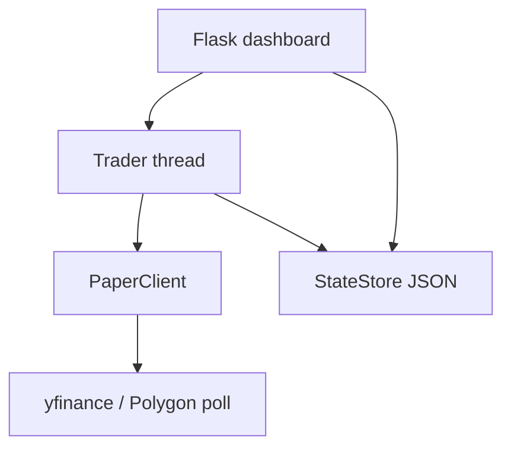

# AndrewTrade — Stocktrader (paper)

US equities intraday bot voor **Krush watchlist**-setups: breakout + volumefilter, stop op Hold, target op T1, EOD flatten.

**Paper trading:** gesimuleerde orders + marktdata via **Yahoo Finance** (of Polygon). Geen IBKR, geen gateway.

## Architectuur



## Quick start

```bash
cp stocktrader/.env.example .env
pip install -r stocktrader/requirements.txt
python -m stocktrader.dashboard
```

Open `http://localhost:5001`, plak watchlist, **Start**.

## Belangrijkste env-vars

| Variabele | Default | Beschrijving |
|-----------|---------|--------------|
| `PAPER_CAPITAL` | `1000` | Gesimuleerd startkapitaal |
| `DATA_SOURCE` | `yfinance` | `yfinance` of `polygon` |
| `BAR_POLL_SECONDS` | `60` | Hoe vaak nieuwe 1m bars worden gecheckt |
| `VOLUME_MULT` | `2.0` | Breakout-volume vs ORB-gemiddelde |
| `ORB_MINUTES` | `0` | ORB-window (0 = uit) |
| `STATE_DIR` | `./stocktrader_state` | Dagelijkse JSON state |
| `AUTO_RESUME_TRADING` | `true` | Hervat na pod-restart |

Zie [`stocktrader/.env.example`](stocktrader/.env.example).

## Watchlist

```
XOS  $6.30  $7.00  $8.00  $10.00
STAK 3.50   3.90   4.50   5.00
```

Vier prijzen na ticker: Hold, Break, T1, T2.

## Docker / k8s

```bash
docker build -f Dockerfile.stocktrader -t registry.dizzyman.nl/stocktrader:1.1.8 .
kubectl apply -k k8s/stocktrader-paper/
```

Geen `ib-gateway` nodig. Zet in secret alleen `DATA_SOURCE`, `PAPER_CAPITAL`, `STATE_DIR=/data`, evt. Telegram.

## Backtests

```bash
python backtest_recent_window.py --minutes 20
python backtest_watchlist.py --date 2026-06-04
```

## Tests

```bash
pip install pytest
pytest -q tests/
```

## Let op

- yfinance heeft ~15 min vertraging — geschikt om strategie te testen, niet voor echte latency-arbitrage.
- Dit is **geen** live broker; voor echt geld later een andere execution-laag nodig.
