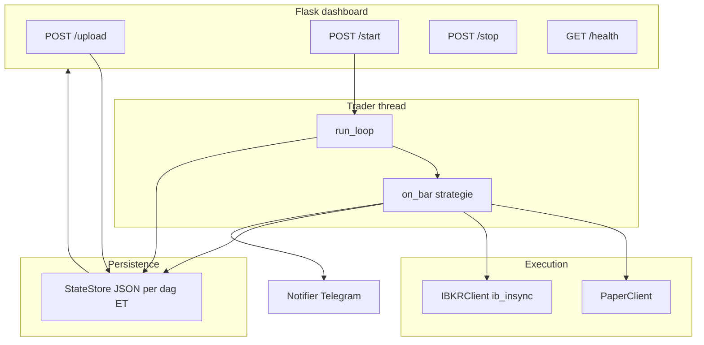

# AndrewTrade — Stocktrader

US equities intraday bot voor **Krush watchlist**-setups: breakout boven Break-niveau met volumefilter (ORB-gemiddelde × `VOLUME_MULT`), stop op Hold, target op T1, flatten vóór marktsluiting.

Flask-dashboard om watchlists te uploaden, de bot te starten/stoppen en live status te zien. Uitvoering via **IBKR Gateway** (live/paper) of **PaperClient** (yfinance/Polygon, geen IBKR).

## Architectuur



**Typische dag**

1. Watchlist plakken in dashboard → `parse_watchlist` → `StateStore`.
2. **Start** → `state.active=true`, `Trader`-thread start.
3. Verbinding (IB Gateway of paper), OTC-filter, 1m bar-stream.
4. Per bar: ORB-volume opbouwen, breakout + volume → entry; Hold/T1 exits; ~15:55 ET EOD.
5. Pod-restart: bij `AUTO_RESUME_TRADING=true` en `state.active` wordt de engine opnieuw gestart.

## Project layout

| Pad | Doel |
|-----|------|
| `stocktrader/` | Runtime: dashboard, trader, IBKR/paper, state |
| `stocktrader/.env.example` | Configuratie-template |
| `backtest_*.py` | Offline backtests (yfinance) |
| `k8s/stocktrader-live/` | Live dashboard + state PVC |
| `k8s/stocktrader-paper/` | Paper-omgeving + ingress |
| `Dockerfile.stocktrader` | Image `registry.dizzyman.nl/stocktrader` |
| `tests/` | pytest (parser, state, market_data) |

## Vereisten

- Python 3.11+
- Live: **IB Gateway** bereikbaar (`IBKR_HOST`, poort 4002 paper / 4001 live)
- Optioneel: Telegram bot voor alerts

## Lokaal starten

```bash
cd andrewtrade
cp stocktrader/.env.example .env
# vul .env in (minimaal PAPER_MODE, STATE_DIR, evt. IBKR_*)

pip install -r stocktrader/requirements.txt
python -m stocktrader.dashboard
```

Dashboard: `http://localhost:5001` (poort via `DASHBOARD_PORT`).

## Belangrijkste omgevingsvariabelen

| Variabele | Default | Beschrijving |
|-----------|---------|--------------|
| `PAPER_MODE` | `true` | `true` = PaperClient, `false` = IBKR |
| `PAPER_CAPITAL` | `1000` | Startkapitaal (paper / tracked) |
| `TRACKED_CAPITAL` | `false` | IBKR-orders wel, sizing uit state |
| `IBKR_HOST` | `ib-gateway` | Gateway host (k8s service) |
| `IBKR_PORT` | `4002` | 4002 paper, 4001 live |
| `IBKR_CLIENT_ID` | `1` | Uniek per verbinding |
| `VOLUME_MULT` | `2.0` | Breakout-volume ≥ mult × ORB-gem. |
| `ORB_MINUTES` | `0` | ORB-window (0 = uit) |
| `AUTO_RESUME_TRADING` | `true` | Hervat na pod-restart |
| `STATE_DIR` | `./stocktrader_state` | JSON per dag (`YYYY-MM-DD.json`) |
| `TELEGRAM_ENABLED` | `false` | Alerts aan/uit |

Volledige lijst: [`stocktrader/.env.example`](stocktrader/.env.example).

## Watchlist-formaat

Tabellen, tabs, bullets of Telegram-markdown; vier prijskolommen na ticker:

```
Stock  Hold    Break   Target1  Target2
XOS    $6.30   $7.00   $8.00    $10.00
STAK   3.50    3.90    4.50     5.00
```

Parser: `stocktrader.parser.parse_watchlist`.

## Strategie (live bot)

- **Entry:** `high >= break_` en `volume >= VOLUME_MULT × orb_avg` (na optionele eerste `ORB_MINUTES` bars alleen volume tellen).
- **Exit:** low ≤ Hold (STOP), high ≥ T1 (T1).
- **EOD:** alle open posities ~15:55 ET.
- **Sizing:** onder `RISK_THRESHOLD_USD` all-in; daarboven risico-based + positiecaps.

Backtests kunnen extra filters hebben (bv. ORB-high in scenario B/C); zie scripts hieronder.

## Docker image

```bash
docker build -f Dockerfile.stocktrader -t registry.dizzyman.nl/stocktrader:1.1.7 .
docker push registry.dizzyman.nl/stocktrader:1.1.7
```

## Kubernetes

**Live** (`stocktrader-live`):

```bash
kubectl apply -k k8s/stocktrader-live/
kubectl rollout status deployment/stocktrader-dashboard -n stocktrader-live
```

- Image: `registry.dizzyman.nl/stocktrader:1.1.7`
- State PVC gemount op `/data` → `STATE_DIR=/data` in secret
- Probes: `GET /health` (degraded als `active` maar engine niet live)
- `replicas: 1`, `strategy: Recreate`

**Paper** (`papertrader` namespace): `k8s/stocktrader-paper/` met ingress `trade.dizzyman.nl`.

Secret `stocktrader-env`: kopieer van `secret.yaml` templates en vul IBKR/Telegram in.

## Backtest-scripts

| Script | Gebruik |
|--------|---------|
| `backtest_watchlist.py` | Eén dag, scenario A/B/C (B/C: ORB-high filter — **niet** live) |
| `backtest_multi_day.py` | Meerdere dagen, compounding cash pool |
| `backtest_recent_window.py` | Laatste N minuten; **dichtst bij live** entry-logica |
| `backtest_jun03.py` | Wrapper één dag |

```bash
python backtest_watchlist.py --date 2026-06-04 --capital 105
python backtest_recent_window.py --minutes 20
python backtest_multi_day.py --capital 50
```

## Hulpmiddelen

- **Liquidatie IBKR:** `python -m stocktrader.close_all_ibkr --yes` (limit DAY; apart van bot EOD market exits).

## Tests

```bash
pip install -r stocktrader/requirements.txt pytest
pytest -q tests/
```

## Notities

- Handelsdag en markturen: **America/New_York** (ET), niet server-TZ.
- Dashboard **HANDELT** = engine-thread live; **ACTIEF — engine uit** = alleen `state.active` op schijf.
- yfinance in dashboard snapshots heeft ~15 min vertraging; live bars komen van IBKR bij `PAPER_MODE=false`.
